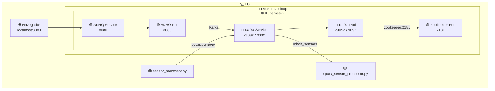

# Pre-entrega 3: 

**Proyecto Integrador: Plataforma de Muestreo Urbano en Tiempo Real**

## Diagrama de Arquitectura


## Entregables

### 1) Configuración del Entorno K8s:

**1.1) Chequeo que el nodo de Kubernetes en Docker Desktop esta lenvantado:**
```bash
kubectl get nodes

NAME                    STATUS   ROLES           AGE    VERSION
desktop-control-plane   Ready    control-plane   3d2h   v1.36.1
```

**1.2) Creación del namespace dedicado y listado de los namespaces:**

```bash
kubectl create namespace pre-entrega-3 
```
```bash
kubectl get namespace
```
**1.3) Configurar para que el namespace pre-entrega-3 sea el predeterminado para trabajar**

```bash
kubectl config set-context --current --namespace=pre-entrega-3
```
```bash
kubectl config get-contexts
```
```bash
CURRENT   NAME             CLUSTER          AUTHINFO         NAMESPACE
*         docker-desktop   docker-desktop   docker-desktop   pre-entrega-3
```
**1.4) Desplegar los manifiestos de Kubernetes**

Dentro de la carpeta k8s, desplegar en el siguiente orden

**1.4.1) Zookpeer**
```bash
kubectl apply -f zookeeper.yml
```
**1.4.2) Apache Kafka**
```bash
kubectl apply -f kafka-configmap.yml
```
```bash
kubectl apply -f kafka.yml
```
**1.4.3) AKHQ**
```bash
kubectl apply -f akhq-configmap.yml
```
```bash
kubectl apply -f akhq.yml
```

**1.5) Confirmar que el despliegue se realizo correctamente**
```bash
kubectl get pods

NAME                         READY   STATUS    RESTARTS   AGE
akhq-7bf6bccbbb-vx68p        1/1     Running   0          1h
kafka-6dfd555d84-9vbkm       1/1     Running   0          1h
zookeeper-86dfc479c4-t5jrm   1/1     Running   0          1h

```
**2) Acceder desde el navegar a AKHQ con http://localhost:8080**

**3) Desde la terminal ejecutar el script de python procesador: spark_sensor_processor.py**
```bash
python spark_sensor_processor.py
```
**4) Desde otra terminal ejecutar el script de python productor: sensor_producer.py**
```bash
python sensor_producer.py 
```
## Datos Producidos por el productor y procesador por Spark:

Se incluye archivo spark_sensor_processor.log en el repositorio

```markdown

Batch: 1
-------------------------------------------
+------------------------------------------+-------------+---------------+---------------+
|window                                    |sensor_id    |avg_temperature|avg_air_quality|
+------------------------------------------+-------------+---------------+---------------+
|{2026-08-16 23:16:00, 2026-08-16 23:17:00}|sensor_zona_2|16.46          |23.0           |
|{2026-08-16 23:16:00, 2026-08-16 23:17:00}|sensor_zona_1|28.02          |125.0          |
|{2026-08-16 23:16:00, 2026-08-16 23:17:00}|sensor_zona_4|26.04          |84.0           |
|{2026-08-16 23:16:00, 2026-08-16 23:17:00}|sensor_zona_5|32.275         |62.5           |
+------------------------------------------+-------------+---------------+---------------+

-------------------------------------------
Batch: 2
-------------------------------------------
+------------------------------------------+-------------+------------------+---------------+
|window                                    |sensor_id    |avg_temperature   |avg_air_quality|
+------------------------------------------+-------------+------------------+---------------+
|{2026-08-16 23:16:00, 2026-08-16 23:17:00}|sensor_zona_2|16.46             |23.0           |
|{2026-08-16 23:16:00, 2026-08-16 23:17:00}|sensor_zona_1|27.133333333333336|88.5           |
|{2026-08-16 23:16:00, 2026-08-16 23:17:00}|sensor_zona_4|27.535            |61.0           |
|{2026-08-16 23:16:00, 2026-08-16 23:17:00}|sensor_zona_5|34.07333333333333 |55.0           |
+------------------------------------------+-------------+------------------+---------------+

```
