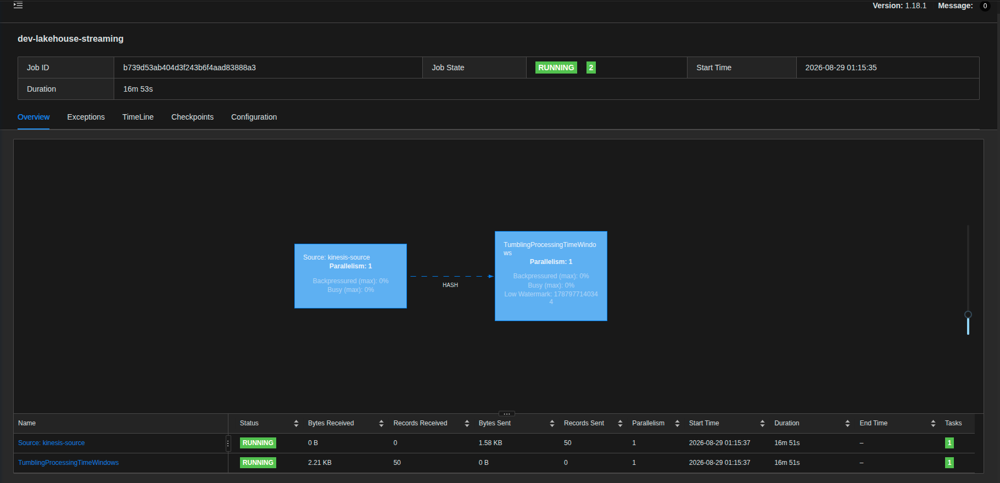
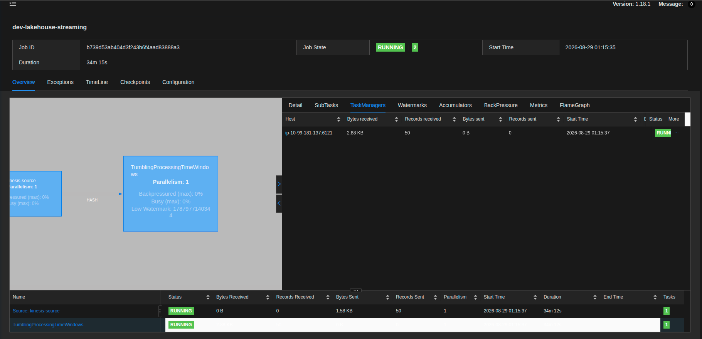

# Pre-entrega 4: Procesamiento en tiempo real

## Logica de negocio

Consiste en un Job de Apache Flink, que consume los eventos de los sensores de temperatatura desde Kinesis.

Primero identifica a qué sensor pertenece cada evento mediante el id del sensor(sensor_id) que se utiliza como clave (Keyed State).
Después agrupa los eventos(mediciones) de cada sensor en ventanas consecutivas de un minuto. Dentro de cada ventana mantiene un estado con la suma de las temperaturas y la cantidad de eventos recibidas. 
Cuando finaliza el minuto, calcula el promedio de temperatura del sensor. Como este procesamiento mantiene estado, utilizamos checkpoints para poder recuperar la información ante una falla. De esta manera, transformamos un flujo continuo de mediciones individuales, en un indicador agregado de temperatura promedio por sensor y por minuto.

El Job de Flink esta configurado con un paralelismo de 1, lo que significa que el procesamiento se realiza con una única subtarea. El paralelismo por KPU de 1, es decir una unica subtarea por cada KPU.
1 KPU = 1 vCPU + 4 GB de RAM.
Esta configuracion se mantiene fija, ya que no esta habilitado el auto escalado en AWS.

**La logica es la siguiente:**

**1) Flink consume los eventos de los sensores de temperatura desde el stream de Kinesis**, recibiendolos continuamente para poder procesarlas en tiempo real.

**2) Flink identifica cada sensor** Extrae de cada evento el sensor_id.

**3) Flink agrupa las mediciones en ventanas de 1 minuto** Para cada sensor se procesan las mediciones en ventanas fijas y consecutivas de un minuto que no se superponen. El periodo de un minuto de la ventana se determina por el reloj de la maquina en donde se esta ejecutando Flink.

**4) Flink calcula el promedio de temperatura** transforma las mediciones individuales en la temperatura promedio del sensor durante la ventana de un minuto.

**5) El procesamiento es stateful** Flink conserva las temperaturas, la suma de las mismas y la cantidad de eventos recibidos, para calcular el promedio a medida que llegan los eventos.

**6)Los checkpoints permiten recuperar el estado** Si Flink tuviera una falla,los checkpoints permiten recuperar el estado previamente guardado y continuar el procesamiento.
 
## Evidencia de Ejecución

