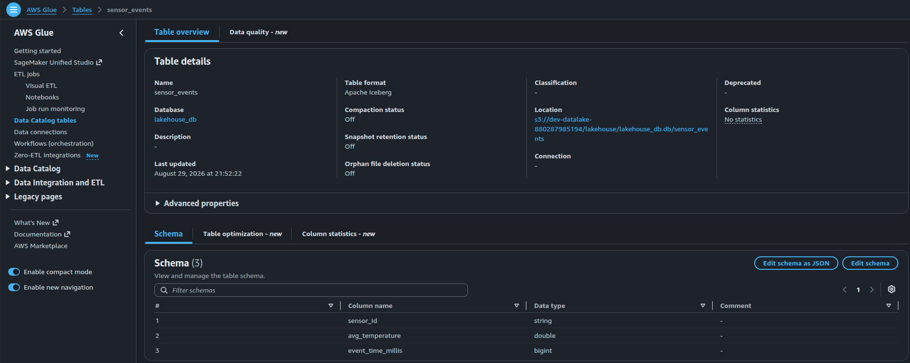
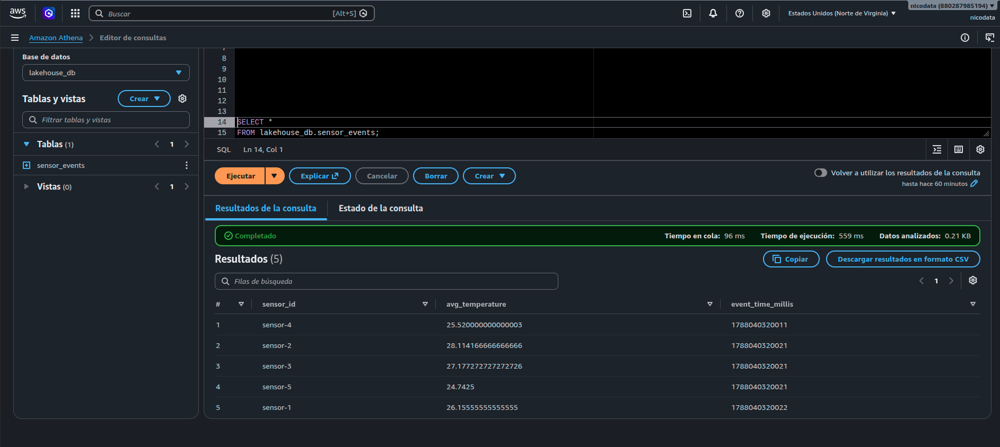

# Pre-entrega 5: pipeline Lakehouse con Iceberg, Glue y catálogo

En esta pre-entrega los datos procesados por Flink en la pre-entrega 4 se almacenan como tablas de **Apache Iceberg** en el bucket de S3, y **AWS Glue Data Catalog** funciona como el catálogo de las tablas, que mantiene la información necesaria para que herramientas de consulta como Athena puedan descubrir la tabla, conocer su estructura y localizar los datos almacenados en S3.

## Evidencia de ejecucion

**Tabla creada en AWS GLUE**



**Consulta SQL en AWS Athena**



**Archivos JSON de metadata en la carpeta de metadata en S3.**

```bash
aws s3 ls s3://dev-datalake-880287985194/lakehouse/lakehouse_db.db/sensor_events/metadata/ --recursive | grep '\.json$'

2026-08-29 18:20:37       1159 lakehouse/lakehouse_db.db/sensor_events/metadata/00000-0d64d068-ed50-4dc4-9ef5-0c5d4e9f919c.metadata.json
2026-08-29 18:51:22       2490 lakehouse/lakehouse_db.db/sensor_events/metadata/00001-636cad85-0d92-4c8c-aa8f-cbf03101f328.metadata.json
2026-08-29 18:52:23       3864 lakehouse/lakehouse_db.db/sensor_events/metadata/00002-ccec67f7-974b-4e1b-a102-f78ad91d6f9c.metadata.json
2026-08-29 19:02:22       5142 lakehouse/lakehouse_db.db/sensor_events/metadata/00003-48382788-451b-4336-a1a1-28f0fef679c3.metadata.json
2026-08-29 19:12:22       6415 lakehouse/lakehouse_db.db/sensor_events/metadata/00004-1cc517bd-f75c-4342-83d9-c494d6fb4b40.metadata.json
2026-08-29 19:22:22       7694 lakehouse/lakehouse_db.db/sensor_events/metadata/00005-2527fdfe-32ac-43aa-984b-04508367b8b4.metadata.json
2026-08-29 19:32:22       8972 lakehouse/lakehouse_db.db/sensor_events/metadata/00006-6c8b6732-30eb-42be-92e6-30d2d26736a2.metadata.json
2026-08-29 19:42:22      10250 lakehouse/lakehouse_db.db/sensor_events/metadata/00007-adeae805-b975-42c2-ac16-2bc27bf78613.metadata.json
2026-08-29 19:52:22      11528 lakehouse/lakehouse_db.db/sensor_events/metadata/00008-6865ed1c-d83a-4ae5-bbbd-a51b71f39836.metadata.json
2026-08-29 20:02:22      12806 lakehouse/lakehouse_db.db/sensor_events/metadata/00009-4b651515-d655-4522-a75f-5808ce5061df.metadata.json
``
